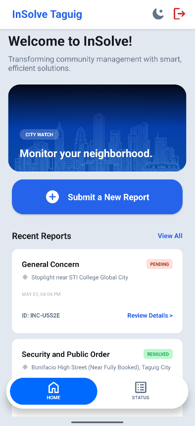
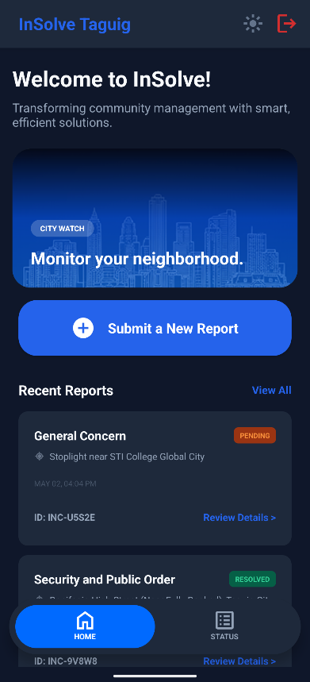
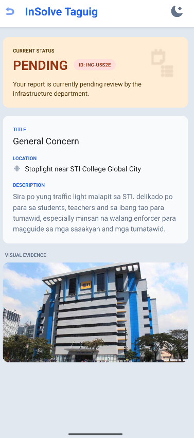

# InSolve: Taguig City Watch 🏙️

Transforming community management with smart, efficient solutions. 

**InSolve** is a real-time Android mobile application designed to bridge the gap between citizens and city administrators. It empowers residents of Taguig City to easily report neighborhood incidents (such as potholes, infrastructure damage, and hazards) while providing administrators with a powerful dashboard to track, review, and resolve issues in real-time.

NOTE!! CHECK RELEASES FOR THE APK FILE

---
## Key Features

### For Citizens (Users)
* **One-Tap GPS Location:** Automatically pinpoint and auto-fill the exact incident address using the device's native GPS.
* **Integrated Camera & Gallery:** Attach crucial visual evidence by snapping a live photo directly within the app or uploading an existing image from the gallery.
* **Seamless Incident Reporting:** Submit comprehensive reports with detailed descriptions of the situation on the ground.
* **Real-Time Status Tracking:** Instantly see when a report moves from *Pending* to *In Progress*, *Resolved*, or *Rejected*.
* **Official Admin Remarks:** Read direct feedback and updates from city dispatchers regarding submitted reports.

### For Administrators
* **Live Analytics Dashboard:** View system-wide statistics (Total, Resolved, Pending, Rejected) that update instantly without refreshing.
* **Efficient Triage:** Review incoming reports, assess evidence, and update status tags with just a few taps.
* **Direct Communication:** Leave official remarks on reports to keep citizens informed of the resolution process.

### App-Wide Features
* **Real-Time Data Sync:** Powered by Firebase Realtime Database, ensuring all dashboards and lists update flawlessly the second data changes.
* **Dynamic Theming (Dark Mode):** Fully responsive Light and Dark mode UI, featuring semantic color palettes and seamless instant-transition animations.

---

## Tech Stack

* **Language:** Java
* **Platform:** Android
* **Backend / Database:** Firebase Realtime Database
* **Architecture:** Native Android XML Layouts, RecyclerViews

---

## Screenshots

| Light Mode Dashboard | Dark Mode Dashboard | Report Details |
| :---: | :---: | :---: |
|  |  |  |

---

## Download & Installation

You can install InSolve directly on your Android device using the provided APK file. 

1. **Download the APK:** Navigate to the [Releases](https://github.com/viancuhh/InSolve-Mobile/releases/tag/IncidentReport) page of this repository and download the latest `InSolve.apk` file to your Android phone.
2. **Allow Unknown Apps:** Before installing, your phone may ask for permission to install unknown apps. Tap **Settings** on the prompt and toggle **Allow from this source**.
3. **Install:** Tap the downloaded `InSolve.apk` file and select **Install**.
4. **Launch:** Once the installation is complete, open the app, create an account, and start exploring!

---

## 📝 License
This project is licensed under the [MIT License](LICENSE).
